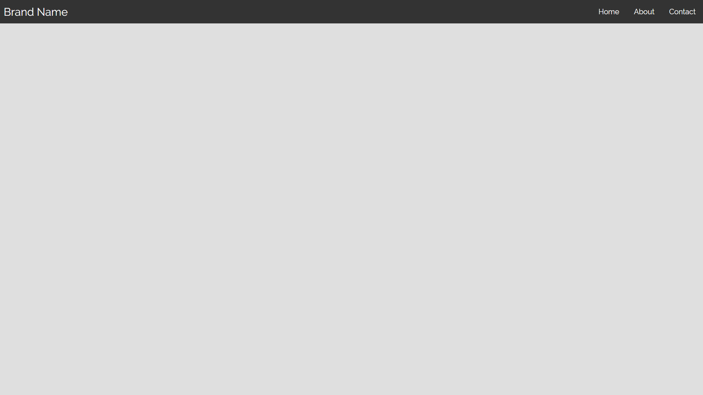
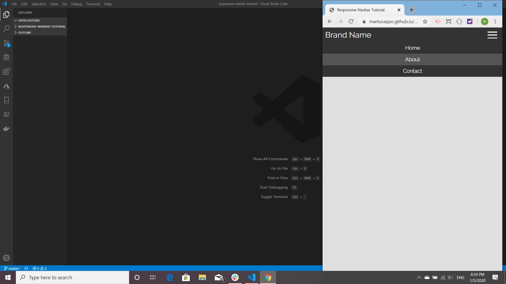
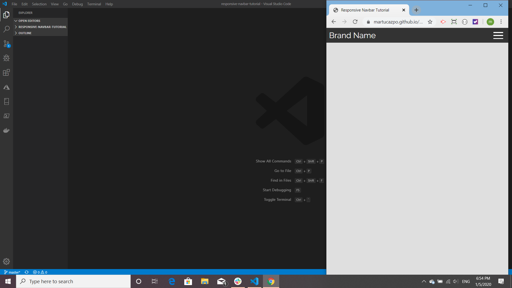

# responsive-navbar-tutorial

This responsive navbar is a [tutorial](https://www.youtube.com/watch?v=At4B7A4GOPg&list=PLZlA0Gpn_vH8mpXIUHjWoMAAgoCEinL0R&index=5&t=0s) on [Web Dev Simplified](https://www.youtube.com/channel/UCFbNIlppjAuEX4znoulh0Cw/playlists). None of the code is mine. It is a series of css exercises that I am doing to improve my knowledge of CSS. I had never before made a hamburger menu.

This is the page (specifically the navbar) at full size:

When the width is less than 600px the links disappear and the hamburger shows:

Clicking on the hamburger lowers the links:

Here the links are hovered over:

On click the hamburger shuts again:

My rendering of this tutorial is [published on Git Hub](https://martucazpo.github.io/responsive-navbar-tutorial/)